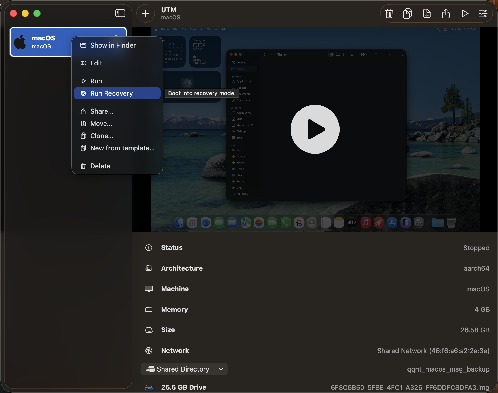
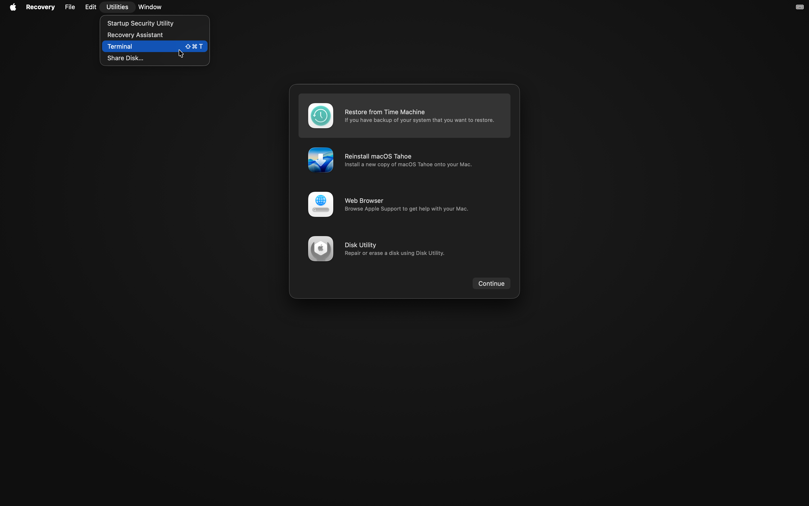
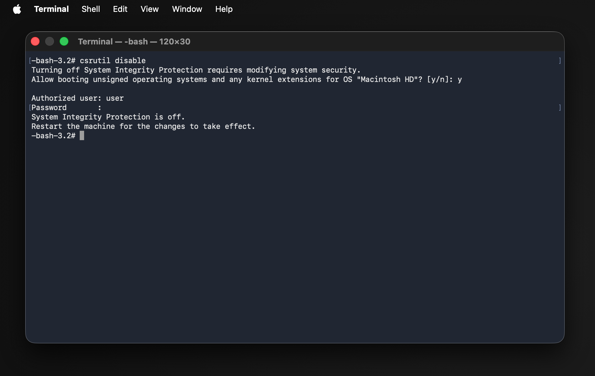
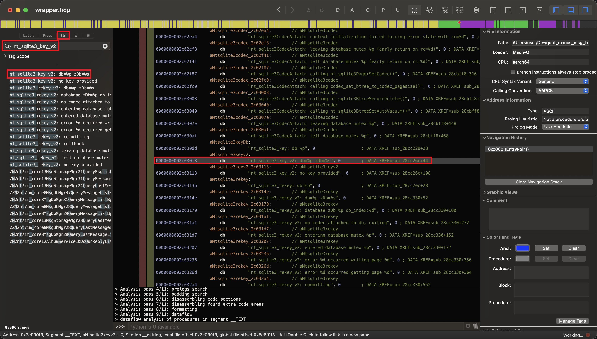
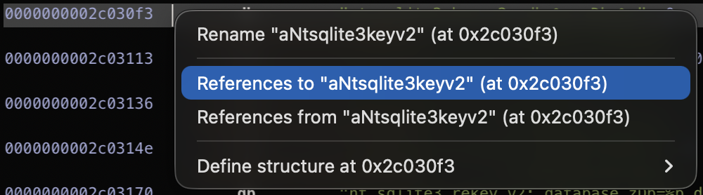
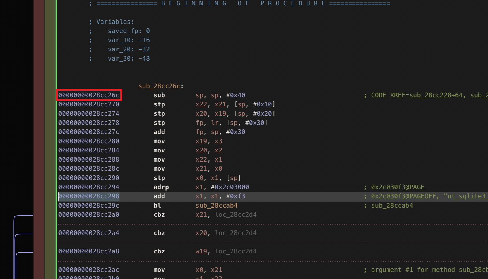
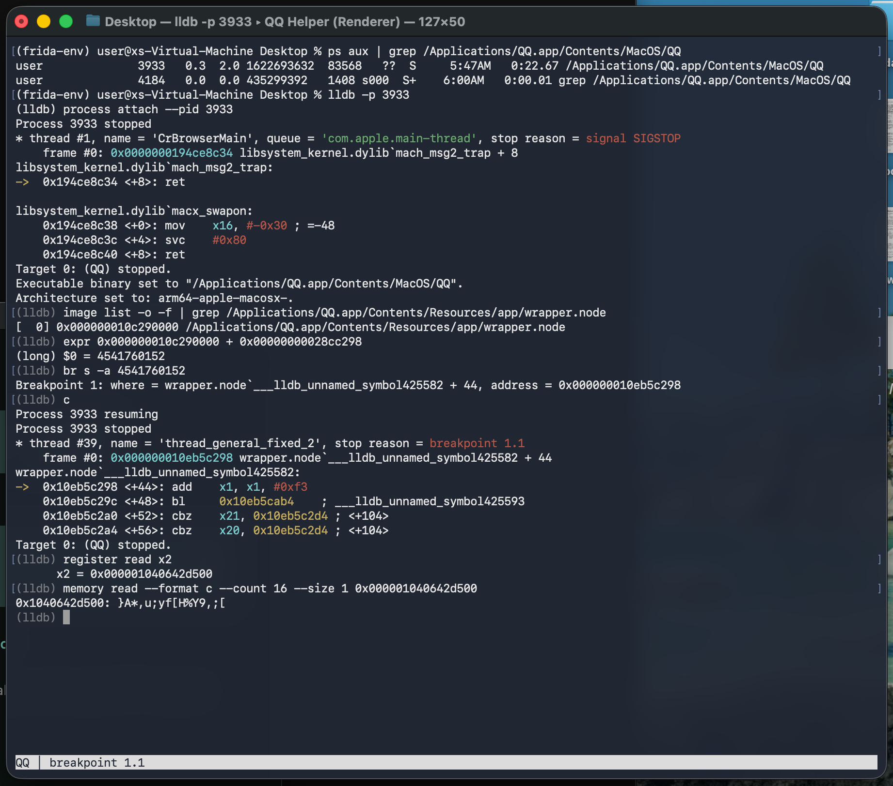
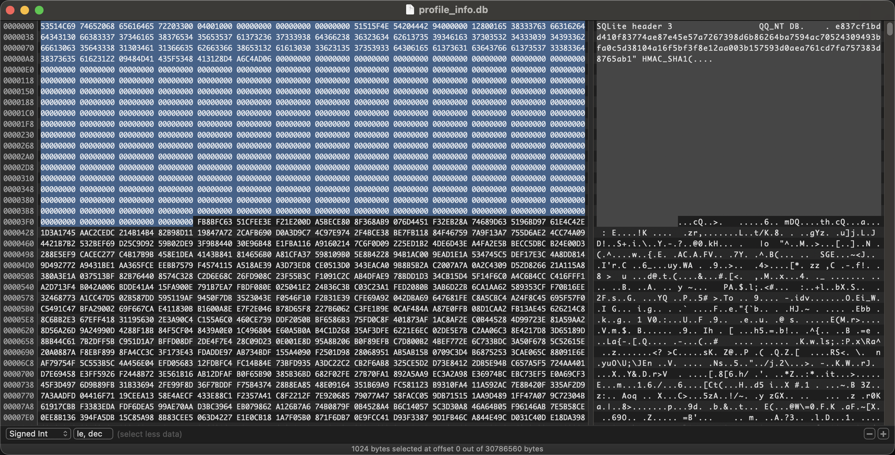
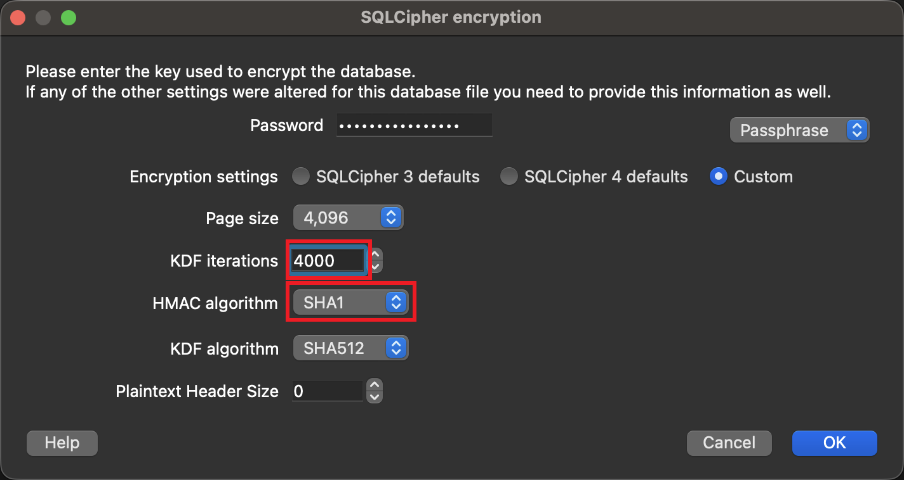
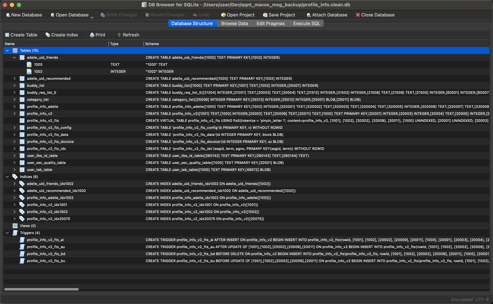

## 背景

为了应对导出 QQ 聊天数据到本地保存备份的需求，需要访问 QQ 相关数据库文件。然而，这些数据库文件是被加密的。要获取数据库密码，可按照文章「[解析 NTQQ 数据库](https://lengyue.me/2023/09/19/ntqq-db/)」提到的步骤进行操作。

本文用于记录数据库密码获取流程，步骤与文章「[解析 NTQQ 数据库](https://lengyue.me/2023/09/19/ntqq-db/)」的内容基本一致。

因为整个流程的完成需要关闭 macOS 系统完整性保护 (SIP)，为系统安全性考虑，本文使用虚拟机进行操作。

## 准备

- `/Applications/QQ.app`
- `~/Library/Containers/com.tencent.qq/Data/`
- Hopper Disassembler
- 虚拟机软件（本文使用 [UTM](https://github.com/utmapp/UTM)）
- [DB Browser for SQLite](https://sqlitebrowser.org/)

## 环境

- 物理机 macOS 版本: Tahoe 26.3 (25D125)
- 虚拟机 macOS 版本: Tahoe 26.3.1 (25D2128)
- QQNT 版本: 6.9.39-25493
- UTM 版本: 4.7.5 (118)
- Hopper Disassembler 版本: 5.16.0
- DB Browser for SQLite 版本: 3.13.1

## 流程

### 一、虚拟机安装与必要文件迁移

1. **安装虚拟机**：使用 Parallels Desktop, VMware Fusion 或 UTM（免费开源）在您的 Mac 上安装一个 macOS 虚拟机。
2. **在虚拟机内关闭 SIP**：
   - 启动虚拟机并进入**虚拟机的恢复模式**：
     - **UTM (Apple Silicon)**：在 UTM 主界面，右键点击您的 macOS 虚拟机，选择“运行恢复 (Run Recovery)”。或者在启动时持续长按虚拟机的电源播放按钮，直到出现“正在载入启动选项”。
     - **Parallels / VMware**：通常可以在虚拟机关机状态下，通过菜单栏的“操作”或右键菜单找到“启动到恢复模式”选项；Intel 架构也可以直接在虚拟机内按 `Command + R`。
   - 在虚拟机的恢复模式终端中执行 `csrutil disable`，然后重启虚拟机。

3. **迁移 QQ 数据到虚拟机**：
   > 可使用虚拟机软件的共享文件夹功能来复制文件到虚拟机。
   - 需要解密的是**物理机**上的聊天记录。
   - 将相同版本的 QQ.app 复制到虚拟机中的 `/Applications/` 路径下。
   - 将物理机上的完整 QQ 数据文件夹（即 `~/Library/Containers/com.tencent.qq/Data/` 目录）传输到虚拟机中的相同本地路径下。

### 二、Hopper Disassembler 分析关键函数位址

将文件 `/Applications/QQ.app/Contents/Resources/app/wrapper.node` 复制到其他目录，并在 Hopper Disassembler 软件中打开分析。

搜索 `nt_sqlite3_key_v2` ：

转到函数引用处：

找到关键位址：

记下此地址。

### 三、LLDB 断点调试

流程包括：

1. 运行 NTQQ 并获取其进程 ID
2. 使用 LLDB 附加 NTQQ 进程（命令：`lldb -p <pid>` ）
3. 寻找 wrapper.node 的加载地址
4. 结合之前记下的关键位址，计算 nt_sqlite3_key_v2 的内存位址
5. 在关键内存位址设置断点
6. 使 QQ 继续运行，登录 QQ，使断点命中
7. 解析函数参数获得密钥

### 四、使用密钥解密数据库

需要删除数据库前 1024 个字节的数据才能正确解密数据库。

使用 DB Browser for SQLite 打开数据库，输入密码并调整参数：

解密成功后，可看到数据库中包含的数据表：

至此，数据库密码获取成功且解密成功。

## 参考文章

> 非常感谢以下文章的作者探索并分享获取数据库密码的方法！

- [解析 NTQQ 数据库｜冷月的博客](https://lengyue.me/2023/09/19/ntqq-db/)
- [NTQQ (macOS ARM) | QQDecrypt](<https://qqbackup.github.io/QQDecrypt/decrypt/NTQQ%20(macOS%20ARM).html>)
