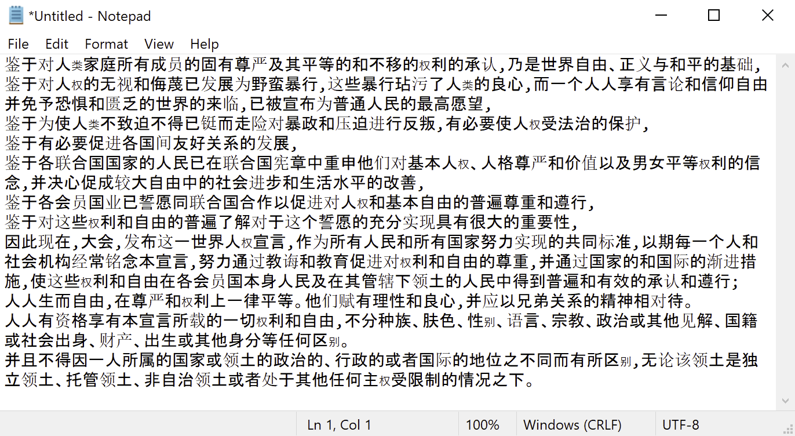
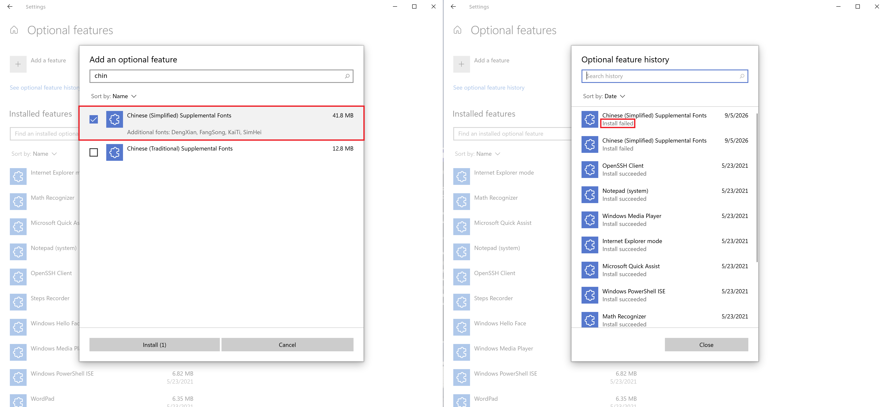
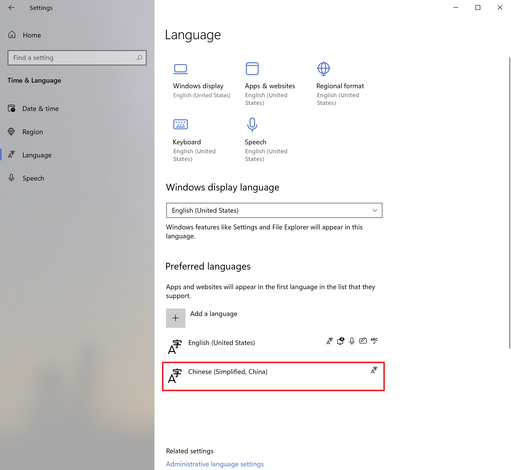
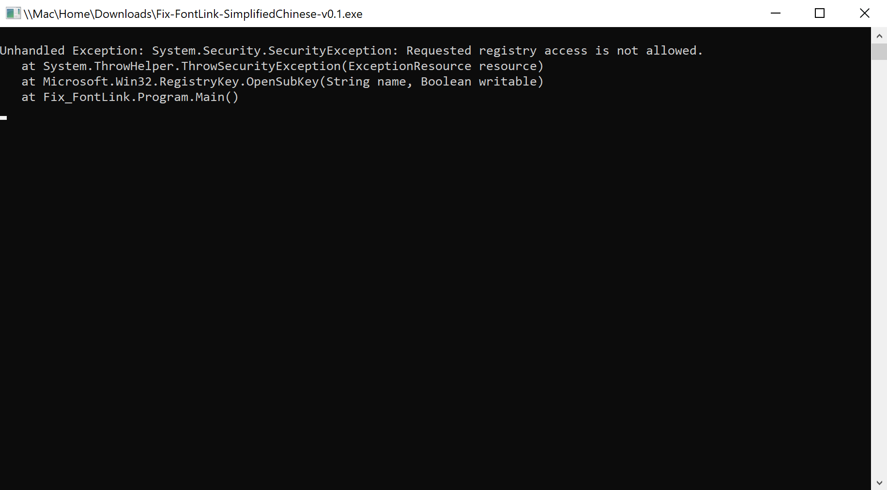
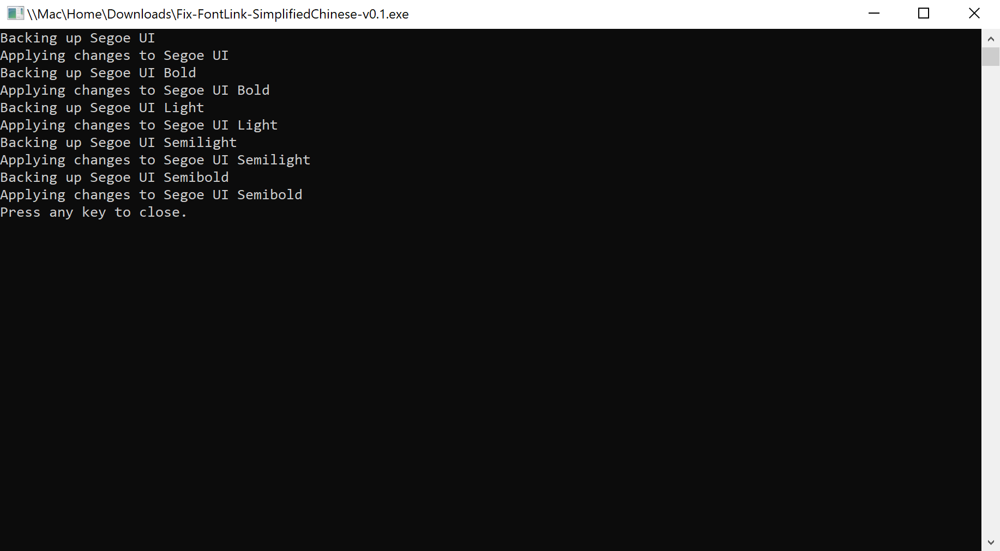
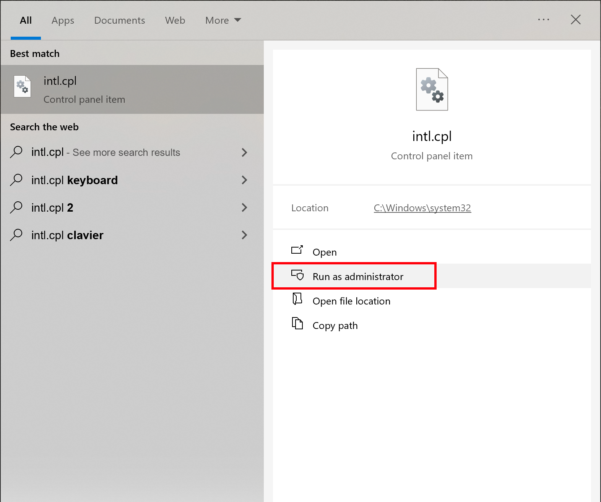
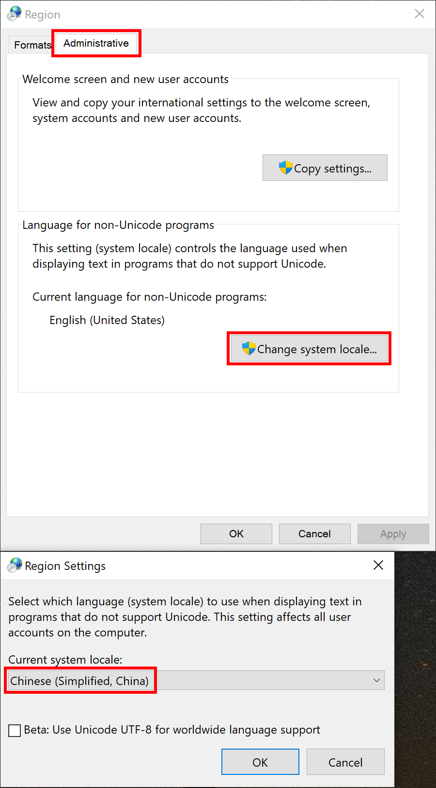
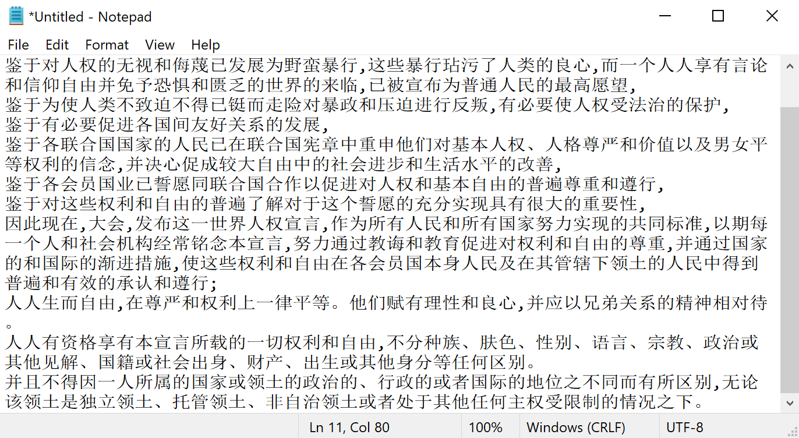

## 问题概述

非中文系统的 Windows 的中文字形看上去不一致，显示的效果如下图所示。

可以看到，字体的显示有很多问题：

1. 中日文字形混杂。
2. 字体不一致。
3. 文字大小粗细不一。

> 系统信息:  
> **Edition:** Windows 10 Home  
> **Version:** Dev  
> **OS build:** 21390.1  
> **Experience:** Windows 10 Feature Experience Pack 321.13302.10.3  
> **System type:** 64-bit operating system, ARM-based processor

## 解决方案概括

经过查阅资料，AI 总结的解决方案如下：

1. **基础步**：
   - 打开 **Settings** → **Apps** → **Optional features**，安装 **Chinese (Simplified) Supplemental Fonts**。
   - 在 **Settings** → **Time & Language** → **Preferred languages** 中，将 **中文（简体）** 拖动到英文正下方（排在 Japanese/Korean 前面）。
2. **核心步**：
   - 运行开源工具 [zBuffer/fix-fontlink](https://github.com/zBuffer/fix-fontlink)，或手动修改注册表 `HKEY_LOCAL_MACHINE\SOFTWARE\Microsoft\Windows NT\CurrentVersion\FontLink\SystemLink`，将各西文字体（Segoe UI、Tahoma 等）的备用字体首行设为 `MSYH.TTC,Microsoft YaHei UI`。
3. **兼容步**：
   - 运行 `intl.cpl` → **Administrative** → **Change system locale...** → 改为 **Chinese (Simplified, China)**，解决经典 Win32 程序退回宋体的问题。

## 流程记录

接下来我根据以上解决方案来操作，并记录流程。

1. 安装 **Chinese (Simplified) Supplemental Fonts**

   我尝试了安装，但安装失败。我决定跳过这一步。

   

2. 将 **中文（简体）** 设为偏好语言

   

3. 使用开源工具 zBuffer/fix-fontlink 一键修复

   需要使用管理员权限运行，否则会报错，如下图。

   

   正常运行结果如下。

   

   运行完成后，在同一文件夹下会生成注册表备份文件，文件名类似于 `20260905173110-regbackup.reg`，应该是用于恢复原状的。

4. 注销重新登录

   桌面上的字形变正常了。

   

   但打开记事本后，发现问题仍然存在。

5. 将系统 locale 设为中文

   运行 `intl.cpl`。

   

   更改系统 locale 为中文。

   

   更改后需要重启才能生效。

   

6. 重启系统

   

   打开记事本和各种软件查看显示效果，发现所有中文字使用同一个字体，字形显示混乱的问题已解决。

   

   

## 参考

- [Microsoft Community: Chinese fonts rendering problem on Windows 10 Pro (English)](https://answers.microsoft.com/en-us/windows/forum/windows_10-performance/chinese-fonts-rendering-problem-on-windows-10-pro/481f1032-156a-449e-bbc0-204f9cc139c5)
- [Microsoft Learn: Customize font selection with font fallback and font linking](https://learn.microsoft.com/en-us/globalization/fonts-layout/fonts)
- [Microsoft Learn: Fonts included in optional font features (补充字体功能)](https://learn.microsoft.com/windows/deployment/windows-10-missing-fonts)
- [Shajisoft: Fontlink for CJK on English Windows 10](https://shajisoft.com/shajisoft_wp/fontlink-for-cjk-on-english-windows-10/)
- [泛用型自宅机器人：Windows 字体折腾指南](https://moeologist.github.io/win-font/)
- [知乎专栏：通过字体映射 Fontlink 美化中文显示](https://zhuanlan.zhihu.com/p/205133009)
- [CSDN：解决 Windows 10 英文版中文字体难看、时大时小等问题](https://blog.csdn.net/amoscn/article/details/106224359)
- [V2EX：英文版 windows 11 中文字体粗细不一怎么解决](https://www.v2ex.com/t/1003380)
- [V2EX：Windows11 英文版某些软件 UI 中英文字体显示很奇怪，像是宋体？](https://www.v2ex.com/t/1082918)
- [知乎：如何改变 Windows 10 的字体回退（fallback）顺序？](https://www.zhihu.com/question/64884360)
- [Super User: How to change / configure font fallback?](https://superuser.com/questions/396160/how-to-change-configure-font-fallback)
- [GitHub: zBuffer/fix-fontlink](https://github.com/zBuffer/fix-fontlink)
